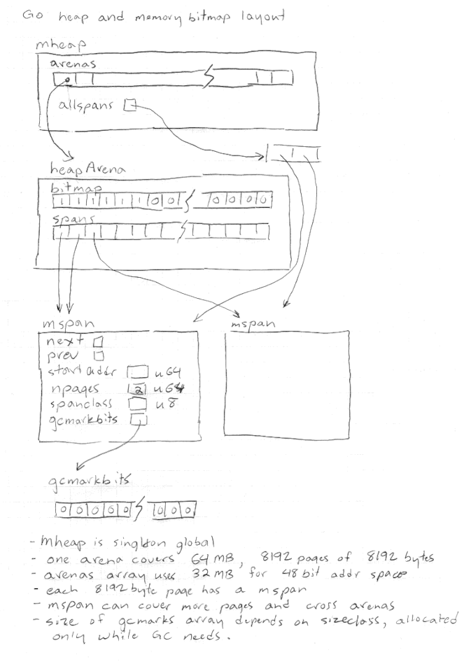

.. _gc:

++++++++++++++++++++++++++
CPython Garbage Collection
++++++++++++++++++++++++++

See also :ref:`Tracing GC for CPython <tracing-gc>`.

Terminology
===========

* GC: garbage collection, i.e. automatic freeing of unused memory
* GIL: the CPython global interpreter lock (prevents multiple threads from
  corrupting things).
* RC: a reference counting GC or the reference count for an object
* Tracing: tracing based GC. A tracing GC works by starting from roots,
  following object references to determine all alive objects.
* Mark and Sweep (M&S): a form of tracing GC. It is one of the older methods
  and without elaborations doesn’t work well for large programs (collection
  time is O(n) where n is heap size).
* Root: In tracing collection, an object pointer that is followed to determine
  which objects are alive.
  A precise (non-conservative) GC needs more help to find the roots.
* Conservative: a GC that does not 100% accurately identify roots and will
  therefore sometimes not free memory that it could. Needs little or no help to
  find the roots. Libgc is a conservative GC.
* Precise: a GC is that non-conservative. I.e. it can 100% accurately identify
  all roots.
* Libgc: The Boehm-Demers-Weiser conservative garbage collector
* Moving: a moving GC is allowed to move objects within the heap. Once moved, all references
  to that object must be repaired by the GC. Libgc is an example of a
  non-moving GC.
* Copying: a copying GC is one type of moving GC
* Incremental: an incremental GC can process part of the heap in one step,
  rather than doing a complete GC pass at once
* Concurrent: a concurrent GC will allow other program (sometimes called
  mutator) execution while the GC is doing work. Typically some locking would
  still be involved but the GC is designed to try to maximize concurrency
* Generational: a GC that divides the set of objects into different sets based
  on their age.  Typically there would be about three generations. The youngest
  generation collected the most often.
* Finalizer: a function or method that runs when an object is being freed by
  the GC. In Python __del__ methods or weak-reference callbacks. The running of
  these functions and methods is called “finalization”.
* Weakref: weak reference, a reference to an object that does not keep the
  object alive. If the object is freed, the weakref returns None

Summary of Discussion on Oct 19, 2020
=====================================

During the online Python core dev sprint.

There was a fair amount of discussion on how CPython’s internal GC might be
changed to a tracing collector. General consensus is that we need to support
existing C extensions without having them change many lines of code. Something
like HPy could be functional but would require them to change all lines of code
that interact with Python objects.

A mark & sweep collector as an initial proof-of-concept was suggested by Neil
and Pablo. Mark Shannon noted that a pure M & S will be horribly slow for a
large heap and you likely need an incremental GC. We believe an incremental
collector is possible but it takes more work. A generational collector would be
good too but you might need “write barriers”.

Thomas Wouters believes the best way to provide a compatible C API is to have
proxy objects mirroring the internal objects. The proxy objects would have
refcnt fields and the internal objects would not. One advantage of this design
is that it could be better if GIL is removed (i.e.  for concurrent updates of
refcnts). Neil asked if the refcnt can be put in the internal object and the
proxy be eliminated. Mark Shannon believes objects having different headers
will be a pain.

There was some discussion if Py_INCREF could be changed to mean “create a new
root”. It seems maybe a full refcnt would be needed to provide a compatible
API.  Mark observed that if you don’t care about concurrency, RC is quite a
performant way to do memory management.

Regarding providing a compatible API, Thomas stated:

    I think the fundamental requirement for that approach to work is that
    extension modules don't poke at internal data of Python objects that are
    not defined by themselves. I'm not entirely sure that holds true, but it
    should be the most common case.  the difference with PyPy is, of course,
    that C code that defines and creates PyObjects and that doesn't use the GC
    API would just keep using the existing objects. They pay the cost of
    proxying, but only for their own objects.

Also regarding compatibility, Thomas stated:

    numpy is a giant mess in all this, because it's so tightly coupled with
    CPython implementation details (it copies type structs from builtin types),
    and it exposes its own C API. Any change is going to break them.

There was an extended discussion with Guido, talking about ways of providing a
compatible API and how the “facade” or “proxy” objects would work. There was
also discussion about the GIL and how locking must be done to avoid segfaults
if it is removed. In the Java world, the JVM memory model provides a solid
specification of the memory behavior and so code running with those guarantees
is easier to make safe in a multi-threaded context.

Summary of Discussion on Oct 20, 2020
=====================================

Neil suggested a “straw-man” model of how the “proxy” objects might be
implemented, in order to provide a compatible API for extensions. Inspired by
Ruby's fixed size, 40 byte objects: make these fixed sized objects do the job
of the proxy objects that Thomas Wouters was proposing in his libgc experiment.
I.e. any PyObject pointers you give out to external C-API users would point to
these fixed size object slots. The Python tracing GC would not move them. It
would mean if you have a PyTuple, you can't get at the tuple elements just by
casting the structure and moving a fixed offset. Instead, you would have to
follow the pointer to where the array of elements is actually stored. And, the
GC is free to move that array. Unlike the Pypy model, CPython would always use
those fixed size objects. So the entries in a PyTuple would be object pointers
going to the fixed size objects (same as what is returned to external API
users).  That avoids the API boundary problem Pypy has where it has to allocate
proxies for all of the PyList or PyTuple elements, just in case someone looks
at them.

Python GC Discussion, Meet on Oct 22, 2020
==========================================

Participating
-------------

* Neil Schemenauer
* Larry Hastings
* Pablo Galindo Salgado
* Joannah Nanjekye
* Eric Snow
* Lewis Gaul

Discussion summary
------------------

* Big questions: What are we trying to do? Why?
* Big goal: Replace internal reference counting GC with tracing collector
* We must continue to support existing C extensions, without major source code changes.

  * Support of old API could be done with “shim layer” and proxy objects, like
    is done with PyPy cpyext. Might be slower but likely not as slow as cpyext.
  * Supporting extensions that use custom allocators for PyObjects? We don’t
    care if we force them to use CPython’s runtime to allocate all PyObjects.
    Pretty rare for extensions to use custom allocators.
  * Another issue is switching the underlying allocator used by obmalloc
    (Python runtime). Not sure if you do that with an envvar or you can
    actually switch while Python is running. Could be hard to support.
  * Can we force extensions to stop using macros, stop looking inside of certain
    PyObjects, e.g. inside a list, stop using borrowed references?
  * If we get NumPy and Cython to update to a changed API, it will help a lot.
  * NumPy might be very slow to adapt to C API changes, example was removal of
    some globals done for sub-interpreters. Seems NumPy will take a long time
    to adapt to that.

* Tracing GC options

  * Moving vs non-moving
  * Conservative?
  * Adopt existing library/toolkit or build our own?

* How to support existing C extensions (proxy?, similar to what PyPy does with cpyext)
* How does CPython internals have to change to support tracing GC? Will it be too
  disruptive?
* Aside from technical implementation challenge two issues:

  * Some kind of breakage for external programs/extensions is virtually
    certain. Can we convince the community to back change? Need “carrot” for
    them to want it, otherwise why would they? Suggested “carrot”: removal of
    the GIL.
  * Larry thinks the GIL removal and the breakage should come together.
    Otherwise, you break things with only the promise of better things later.
    Later good things might not come.

* Existing GC libraries, frameworks that might be integrated

  * IBM OMR (C++)
  * MMTk (high performance, cutting edge GC, Rust backend, C API)

* Handling finalizers, e.g. calling finalizers in reference cycles (Boehm GC doesn’t call
  them).

  * __del__ is extremely hard to support in the same style as current CPython.
    Armin Rigo is apparently working on some ideas for PyPy.
  * Likely that GC libraries or toolkits will not provide the “finalizer” hooks
    that could support CPython’s __del__ behavior.
  * Can we just deprecate __del__? Have been telling people for years it is
    dangerous and not recommended to use.
  * Replace with callback() API like is used for Weakref(). You get alive
    objects to your function and you can’t resurrect things.

* How much code breaks if RC is removed and objects don’t die immediately after going
  out of scope? Could be as much or more than the code broken by deprecating __del__.
* Joannah plans to do some work towards us achieving tracing garbage collection as part
  of her PHD.

Summary of Discussion on Oct 22-23, 2020
========================================

There was a fair amount of discussion on the challenges of supporting the full
behavior of Python’s __del__ methods. Since PEP 442, CPython will call
finalizers for objects that are part of garbage cycles. For non-cycles they get
called because the RC naturally gives a topological sorting and so they get
called in the right order. For cycles, there is no topological ordering and so
the GC has no idea what order to call them in. I.e. you have a set of garbage
objects (ready to call tp_clear on), some of them have finalizers, which
finalizer to call first and after you call it, is it safe to proceed with
collection?

The libgc library has a feature to topologically sort garbage before calling
finalizers. So, good so far. However, if there are cycles, Palbo suggested that
libgc will not call the finalizers. I.e.  libgc would act like Python before
PEP 442 was implemented. Thomas suggested later that libgc can be configured to
give a warning and still call the finalizer in that case. If true, it seems
libgc gives us finalization that is close to what we need for __del__.

There was some suggestion (not by Larry ;-) of just killing off support for
__del__ methods. The general consensus seems to be, __del__ methods are a pain
and are often misused, we should not remove them and that somehow a tracing GC
can support the CPython behavior we currently have.

Greg asked if taking away __del__ really is worse than having to repeatedly
tell users that they're trying to use __del__ wrong (it doesn't do what they
thought when they thought)?

Neil speculates that supporting __del__ might require a second GC pass after
the finalizers run.  If we have a generational collector, maybe we can put
things we think are garbage in the youngest generation, run finalizers, then
run a collection of the youngest generation. The generational GC mechanisms
(e.g. write barriers) would ensure we don’t have to re-examine the entire heap
for the second pass and so in theory should be similar to the cost of the PEP
442 extra GC pass.

Neil and Thomas discussed the idea of introducing a safer alternative to
__del__. If we use an API similar to weakref.finalize(), some “foot guns” are
avoided. One issue with __del__ is thatthe finalizer method gets ‘self’ when
really it likely only needs a few properties of self. The straw-man API is
something like::

    class Foo:
        def __init__(self, filename):
            self.fp = gc.with_finalizer(self, open(filename))

The with_finalizer() function can use the context manager methods of ‘file’ to
ensure cleanup.  This seems a nice approach because the finalization logic is
put right where ‘fp’ is created and assigned. ‘with_finalize()’ can be read as
“if X dies, do context manager cleanup on Y”.  Perhaps a first step is to write
a 3rd party PyPI package that provides this API. Then, we could consider moving
it to ‘gc’ and then finally recommend that users switch to it rather than using
‘__del__’.

with_finailizer() can be implemented using weakref.finalizer(). However, that
might not be the best approach. Neil thinks the weakref mechanism would not be
a required implementation approach and there might be a more efficient way. The
implementation of weakrefs in CPython is pretty complicated and not so elegant.
Also, there is an issue with using the weakref approach: if weakref are part of
garbage cycles, the callback is not called. Our argument for that behavior is
there is no defined topological sort and so we could claim the weakref died
first and therefore the callback should not be called. We would need a
different behavior because we still would like the PEP 442 style finalization
rules. I.e. your file will still be closed, even if the file and the thing to
clean it up are part of a garbage cycle.

There was some discussion of disallowing object resurrection from __del__
methods. It’s not so clear how this would work. With refcnts, we might check
the refcnt to see if something was revived. With a tracing GC, maybe a write
barrier can catch the resurrection. If something is resurrected, then what? You
can print a warning or raise an error. However, the GC likely needs to proceed
anyhow and that seems to require another GC pass, similar to how PEP 442 is
implemented.

Thomas wonders how difficult it would be to restructure code to use
‘with_finalizer()’ or a similar thing. If the __del__ method calls methods on
‘self’, there is no easy translation of that. Those methods can access any
attribute of ‘self’. Neil suggested that while painful, that restructuring does
have value in that it forces the programmer to more explicitly decide what
attributes of ‘self’ the finalizer needs to access. An object with a lot of
attributes and methods is a bit like a program with lots of global variables.
You lose track of what depends on what.

Nathaniel Smith notes that:

    async generator finalization relies heavily on resurrection: the
    interpreter gives all async generator objects a shim __del__ which calls
    back to the coroutine runner to schedule atask to run the actual cleanup
    (also note that every generator that contains a yield inside a try or with
    implicitly has a __del__, so there are a lot more __del__ implementations
    out there than most people realize).

The code for the ‘__del__’ is auto generated by it calls into user code by
stepping the generator.  So, that can call arbitrary user code from within the
GC run.

Notes and Collection of References
----------------------------------

Libgc (Boehm collector) experiment
^^^^^^^^^^^^^^^^^^^^^^^^^^^^^^^^^^

Below is the discussion thread for Thomas Wouters “libgc” patch. The thread is
quite long and there are a lot of details about how Python’s GC might be
changed or why we shouldn’t try. Tim Peters has a number of interesting
comments on the page:

https://discuss.python.org/t/switching-from-refcounting-to-libgc/1641

Status of Thomas’s “proof of concept” patch: it hooks into libgc’s finalizer
machinery so that libgc is calling finaliers. It removes calls to
_Py_Dealloc(). The collect() function in gcmodule.c no longer does cyclic GC
and instead calls libgc collection.

Neil is planning to port Thomas’s branch to be on top of CPython 3.9 or the
master branch. A lot of conflicts in merge/rebase because of API renames and
header file reorganization (e.g.  pycore_*). Thomas is not planning to work on
the branch in the near future and doesn’t mind either a rebase or a merge to
bring it closer to the cpython head. Thomas says the code in his published
branch is the most up-to-date work he has.

Using Tracing GC based on existing gcmodule logic (tp_traverse)
^^^^^^^^^^^^^^^^^^^^^^^^^^^^^^^^^^^^^^^^^^^^^^^^^^^^^^^^^^^^^^^

Neil and Palbo discussed the idea of changing gcmodule.c to be a tracing (e.g.
mark and sweep) collector. Quite a few pieces of a M&S collector are already
there, tested and working.  Major challenge is to identify “GC roots”. These
are global C variables, C variables on the stack and CPU registers holding
PyObject pointers.

We discussed the idea of collecting GC roots when an extension module is imported. E.g. have
a special GC_Head list where you put all of the new objects created while importing. Everything
on the list after import is considered a root by the GC. This is a clever idea but after we realized
there are a number of problems with it, maybe fatal.

Libgc solves this “finding roots” problem by using its own tricks. E.g. walking
C stack and having a heuristic test to find object pointers there. This is
called a “conservative” approach since non object pointers (e.g. integers that
look like pointers) will keep things alive that should be freed.

The easier step at this point is to use libgc as a prototype tracing GC
CPython. Likely it doesn’t perform too well but will provide us some feedback.
Also, it would unblock Larry to restart a GIL removal project.

Providing non-moving object references to external API users
^^^^^^^^^^^^^^^^^^^^^^^^^^^^^^^^^^^^^^^^^^^^^^^^^^^^^^^^^^^^

Some good GC optimizations (compaction of heap, new object nursery for fast
object allocation) require that the GC can move objects. After the object is
moved, all references to the object are automatically updated by the GC. That
design requires the GC is absolutely sure of all references, otherwise you have
crashes. The “conservative” approach doesn’t work with a moving GC. Also, if we
can’t get 3rd party extensions to tell us the roots, we can’t move those
objects. This is a good article on pro and con of conservative GC, what must be
done to be precise:

https://blog.mozilla.org/javascript/2013/07/18/clawing-our-way-back-to-precision/

The Spidermonkey documentation is quite extensive and provides a lot of detail
on how embedders of Spidermonkey can mark roots and also details about how the
GC works:

https://developer.mozilla.org/en-US/docs/Mozilla/Projects/SpiderMonkey

Pablo suggested taking a look at what Ruby does with GC and extension APIs.
Ruby is quite interesting in that every Ruby object is exactly 40 bytes long.
That fact vastly simplifies memory management in ways. The downside is you have
an extra indirection if object data doesn’t fit in that 40 bytes. E.g. the
bytes of a string would be allocated elsewhere.

A neat trick with the Ruby 40 byte objects is that they can individually pin
objects, so the GC doesn’t move them. That’s just a bit inside the ruby object
block. Things that are not pinned can get compacted by the GC. Here is video
explaining design:

https://youtu.be/H8iWLoarTZc

The basic idea for allowing a moving collector internally is to have “proxy”
objects that mirror every internal PyObject. The proxy objects would be at a
fixed position in memory and not moved. Since the internal object doesn’t need
a reference count, the field could be moved tothe proxy and we save one word in
the case no proxy is needed (i.e. the object is never revealed through the
reference counting API). This is very close to what pypy cpyext does.  If you
don’t move internal objects at all, having a separate proxy object is probably
not required.  The ref count can be in the internal PyObject and would be zero
if the object was never exposed to the ref counted API. Such a design would be
faster than pypy cpyext for heavy API use because you don’t have to create and
keep in-sync the proxies. The downside is you can’t use a collector similar to
the Pypy ‘incminimark’ one (incremental, generational, moving collector with
new object nursery). Some info on PyPy GC options:

https://doc.pypy.org/en/latest/gc_info.html

Using memory bitmaps to track GC related info
^^^^^^^^^^^^^^^^^^^^^^^^^^^^^^^^^^^^^^^^^^^^^

Neil was initially interested in this technique when exploring the idea of
removing the PyGC_Head data currently allocated before every GC object. Very
briefly, the idea is to pack PyGC_Head data tightly in arrays at the heads of
obmalloc arenas (or something like that). See this discussion:

https://discuss.python.org/t/removing-pygc-head-for-small-objects/1743

Neil’s radix tree obmalloc patch is a step towards that design. It adds the
radix tree for memory arenas. With that change, there is a fast way to find the
arena object for an arbitrary pointer.  The next step would be to add bitmaps
for individual PyObjects and some place to store the GC informat (GC refs, GC
colors). You could also have a bitmap for ‘pinned’ (i.e. GC cannot move the
object). The golang source code is a trove of info about how to do this. See
the following in golang.org/src/runtime/: mheap.go, mbitmap.go.

Here is a hand-drawn sketch of the relevant bits of the Go runtime.

The design enables a fast 'spanOf(p)' function, where 'p' is an object pointer.
Inside the span structure that is returned, you can store the GC_Head info as
described above.

The Go runtime system is an example of the memory allocator and garbage
collector being tightly integrated. They actually split it into more parts:
heap manager (who owns what, provides the spanOf() function), page allocator
(like memory allocator but deals with pages), memory allocator (uses page
allocator, gives out large or small blocks of memory), garbage collector
(decides when things can be freed). The Go runtime is concurrent and if we are
going to remove the GIL, we would have to solve similar problems as they do.

An interesting nugget in the Go runtime is the “packed GC pointer bitmaps”, aka
GC programs.  See “func runGCProg” in the mbitmap.c source file. It is sort of
a little bytecode interpreter that the GC runs to learn which pointers inside
an object are pointers to other objects. Is it possible this could be used for
speeding up tp_traverse or tp_clear somehow? It seems Go only uses it if the
object has lots of internal pointers. Comment from source file is below::

    // Packed GC pointer bitmaps, aka GC programs.
    //
    // For large types containing arrays, the type information has a
    // natural repetition that can be encoded to save space in the
    // binary and in the memory representation of the type information.
    //
    // The encoding is a simple Lempel-Ziv style bytecode machine
    // with the following instructions:
    //
    // 00000000: stop
    // 0nnnnnnn: emit n bits copied from the next (n+7)/8 bytes
    // 10000000 n c: repeat the previous n bits c times; n, c are varints
    // 1nnnnnnn c: repeat the previous n bits c times; c is a varint

    // runGCProg executes the GC program prog, and then trailer if non-nil,
    // writing to dst with entries of the given size.
    //
    // If size == 1, dst is a 1-bit pointer mask laid out moving forward from
    // dst.
    //
    // If size == 2, dst is the 2-bit heap bitmap, and writes move backward
    // starting at dst (because the heap bitmap does). In this case, the caller
    // guarantees that only whole bytes in dst need to be written.

Pablo had the following idea inspired by “GC Progs”:

    Maybe a simple way of trying this idea is to add a 0-terminated array or
    something like that to the GH_HEAD struct and if that is not present for an
    object we use the tp_traverse to compute it. The array would contain the
    offset to every visited object from the object itself: ``pointer_to_visited
    - pointer_to_object`` . Then, our visit functions can iterate over the
    array instead of calling tp_traverse. The downside is obviously the memory
    usage.

Neil suggested that a heap structure like the Go mheap/mspan scheme would
reduce the memory cost of these pointers to arrays. Each “span” object would
have a pointer to the array of offsets. So rather than each object with a
GC_Head having a pointer to the offset table, there would be a pointer per
“span”. A span covers one “page” of memory (not necessarily OS page, typically
8 kB) and so there would be many fewer pointers. You would need to consolidate
the offset array for all objects contained in the span. In the Go source code,
the “gcbitmaps” pointer is the relevant thing. Go has a bitmap instead of an
array of offsets. The bitmap is probably more efficient (memory and speed
wise).
